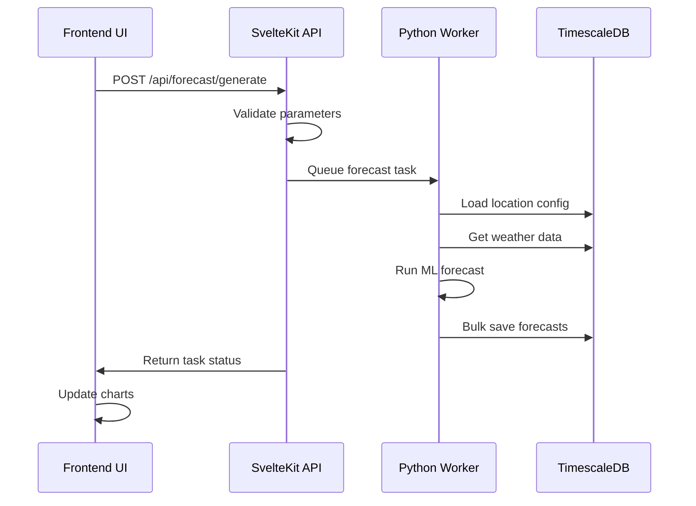

# Solar Forecast Platform - End-to-End Forecasting Process Documentation

## Table of Contents
1. [System Architecture Overview](#system-architecture-overview)
2. [Component Architecture](#component-architecture)
3. [Forecasting Workflow](#forecasting-workflow)
4. [Frontend Layer](#frontend-layer)
5. [Backend API Layer](#backend-api-layer)
6. [Python Worker Layer](#python-worker-layer)
7. [Database Layer](#database-layer)
8. [Complete Process Flow](#complete-process-flow)
9. [Technical Implementation Details](#technical-implementation-details)
10. [Error Handling and Validation](#error-handling-and-validation)
11. [Performance Optimizations](#performance-optimizations)
12. [Code References](#code-references)

---

## System Architecture Overview

The Solar Forecast Platform implements a modern, scalable architecture using the CSR (Controller/Service/Repository) pattern with microservices for ML operations.

### Core Technologies
- **Frontend**: SvelteKit with TypeScript
- **Backend**: SvelteKit API routes with Prisma ORM
- **Database**: TimescaleDB (PostgreSQL extension for time-series)
- **ML Engine**: Python Worker (FastAPI microservice)
- **Visualization**: ECharts for real-time charting

### Architecture Diagram
```
┌─────────────────┐    ┌─────────────────┐    ┌─────────────────┐
│   Frontend UI   │◄──►│  SvelteKit API  │◄──►│ Python Worker   │
│   (Svelte)      │    │   (Node.js)     │    │   (FastAPI)     │
└─────────────────┘    └─────────────────┘    └─────────────────┘
         │                       │                       │
         └───────────────────────┼───────────────────────┘
                                 ▼
                    ┌─────────────────┐
                    │   TimescaleDB   │
                    │  (PostgreSQL)   │
                    └─────────────────┘
```

---

## Component Architecture

### 1. Controller/Service/Repository (CSR) Pattern

**Controllers** (`src/lib/features/forecasts/controllers/`)
- Handle HTTP requests and responses
- Input validation and parameter parsing
- Error handling and status codes

**Services** (`src/lib/server/services/`)
- Business logic implementation
- Data processing and transformation
- Integration with external services

**Repositories** (`src/lib/server/repositories/`)
- Database access and queries
- Data mapping and serialization
- TimescaleDB optimizations

### 2. Multi-Layer Architecture

```
┌─────────────────────────────────────────────────────────┐
│                    Presentation Layer                   │
│  ForecastGenerator.svelte │ EnhancedForecastChart.svelte │
└─────────────────────────────────────────────────────────┘
┌─────────────────────────────────────────────────────────┐
│                    Controller Layer                     │
│     ForecastController.ts │ API Routes (/api/*)        │
└─────────────────────────────────────────────────────────┘
┌─────────────────────────────────────────────────────────┐
│                     Service Layer                      │
│  ForecastService.ts │ forecast.service.ts │ Python API  │
└─────────────────────────────────────────────────────────┘
┌─────────────────────────────────────────────────────────┐
│                   Repository Layer                     │
│ ForecastRepository.ts │ forecast.repository.ts         │
└─────────────────────────────────────────────────────────┘
┌─────────────────────────────────────────────────────────┐
│                     Data Layer                         │
│        TimescaleDB │ Prisma ORM │ Hypertables          │
└─────────────────────────────────────────────────────────┘
```

---

## Forecasting Workflow

### High-Level Process Flow

1. **User Interaction** → Forecast generation request
2. **API Processing** → Validation and task queuing
3. **ML Processing** → Python worker forecasting
4. **Data Storage** → TimescaleDB bulk insert
5. **Visualization** → Real-time chart updates

### Detailed Workflow Steps



---

## Frontend Layer

### 1. ForecastGenerator Component

**File**: `src/lib/components/forecast/ForecastGenerator.svelte`

**Key Features**:
- User parameter selection (horizon, model type, weather options)
- Real-time progress tracking
- Validation warnings for data availability
- Error handling with fallback to mock data

**Parameters**:
```typescript
interface GenerationParameters {
  locationId: string;           // UUID of solar location
  horizonHours: 24 | 48 | 72;  // Forecast time horizon
  modelType: 'ML_ENSEMBLE' | 'PHYSICS' | 'HYBRID';
  useWeather: boolean;          // Include meteorological data
}
```

**API Integration**:
```typescript
// Forecast generation request
const response = await fetch('/api/forecast/generate', {
  method: 'POST',
  headers: { 'Content-Type': 'application/json' },
  body: JSON.stringify({
    locationId,
    horizonHours,
    modelType,
    useWeather
  })
});
```

### 2. EnhancedForecastChart Component

**File**: `src/lib/components/analysis/EnhancedForecastChart.svelte`

**Key Features**:
- ECharts-based interactive visualization
- Multiple chart types (production, weather, comparison)
- Confidence bands and uncertainty visualization
- Real-time data updates
- Time series aggregation support

**Chart Configuration**:
```typescript
interface ChartConfig {
  data: ForecastData[];
  weatherData: WeatherData[];
  historicalData: ProductionData[];
  interval: '15min' | 'hourly' | 'daily' | 'weekly';
  showConfidenceBands: boolean;
  showActual: boolean;
  showWeather: boolean;
  chartType: 'production' | 'weather' | 'comparison';
}
```

**ECharts Series Configuration**:
```typescript
// Confidence bands implementation
series.push({
  name: 'Confidence Range',
  type: 'line',
  data: upperBound,
  areaStyle: { color: 'rgba(15, 164, 175, 0.1)' },
  lineStyle: { opacity: 0 },
  stack: 'confidence'
});
```

---

## Backend API Layer

### 1. ForecastController (CSR Pattern)

**File**: `src/lib/features/forecasts/controllers/ForecastController.ts`

**Key Methods**:

#### `getForecast(event: RequestEvent)`
```typescript
async getForecast(event: RequestEvent): Promise<Response> {
  const { url } = event;

  // Parameter extraction
  const locationId = url.searchParams.get('location_id');
  const interval = url.searchParams.get('interval') as ForecastParameters['interval'];
  const startDate = url.searchParams.get('start_date');
  const endDate = url.searchParams.get('end_date');

  // Validation
  if (!locationId || !['15min', 'hourly', 'daily', 'weekly'].includes(interval)) {
    throw new BadRequestError('Invalid parameters');
  }

  // Service layer call
  const result = await this.forecastService.getForecast({
    locationId, interval, startDate, endDate
  });

  return ApiResponse.success(result);
}
```

#### `generateForecast(event: RequestEvent)`
```typescript
async generateForecast(event: RequestEvent): Promise<Response> {
  const requestData: GenerateForecastRequest = await event.request.json();

  // Validation
  if (!requestData.locationId || ![24, 48, 72].includes(requestData.horizonHours)) {
    throw new BadRequestError('Invalid parameters');
  }

  // Service layer call
  const result = await this.forecastService.generateForecast(requestData);

  return ApiResponse.created(result, 'Forecast generated successfully');
}
```

### 2. ForecastService (Business Logic)

**File**: `src/lib/server/services/forecast.service.ts`

**Key Methods**:

#### Enhanced Mock Forecast Generation
```typescript
private async generateEnhancedMockForecast(params: {
  locationId: string;
  horizonHours: number;
  modelType: string;
  resolution?: string;
}) {
  const { locationId, horizonHours, modelType, resolution = 'hourly' } = params;
  const forecasts = [];

  // Time step calculation
  const timeStepMs = resolution === '15min' ? 15 * 60 * 1000 : 60 * 60 * 1000;
  const steps = resolution === '15min' ? horizonHours * 4 : horizonHours;

  for (let i = 0; i < steps; i++) {
    const timestamp = new Date(startTime.getTime() + i * timeStepMs);
    const hour = timestamp.getHours();

    // Enhanced solar pattern based on model type
    let baseForecast = 0;
    let confidence = 0.85;

    if (hour >= 6 && hour <= 18) {
      const peakHour = 12;
      const hourDiff = Math.abs(hour - peakHour);
      const maxPower = modelType === 'lstm' ? 52 :
                      modelType === 'xgboost' ? 48 : 45;

      baseForecast = maxPower * Math.exp(-(hourDiff * hourDiff) / 20);

      // Model-specific confidence patterns
      confidence = modelType === 'lstm' ? 0.90 + Math.random() * 0.08 :
                  modelType === 'xgboost' ? 0.88 + Math.random() * 0.10 :
                  0.85 + Math.random() * 0.12;

      // Weather-based variation
      baseForecast += (Math.random() - 0.5) * 8;
      baseForecast = Math.max(0, baseForecast);
    }

    forecasts.push({
      locationId: parseInt(locationId),
      timestamp,
      powerForecastMw: parseFloat(baseForecast.toFixed(2)),
      confidenceScore: parseFloat(confidence.toFixed(3)),
      modelType,
      horizonHours: horizonHours
    });
  }

  return forecasts;
}
```

#### Accuracy Metrics Calculation
```typescript
private calculateAccuracyMetrics(data: any) {
  if (!data || data.length === 0) {
    return { accuracy: 0, mape: 0, rmse: 0, mae: 0, r2: 0, nrmse: 0, validPoints: 0 };
  }

  let sumAPE = 0, sumSquaredError = 0, sumAbsoluteError = 0;
  let sumActual = 0, sumForecast = 0, sumActualSquared = 0;
  let sumForecastSquared = 0, sumActualForecast = 0, validPoints = 0;

  data.forEach((point: any) => {
    if (point.actual !== null && point.forecast !== null && point.actual > 0) {
      const actual = parseFloat(point.actual);
      const forecast = parseFloat(point.forecast);
      const error = actual - forecast;
      const ape = Math.abs(error / actual) * 100;

      sumAPE += ape;
      sumSquaredError += error * error;
      sumAbsoluteError += Math.abs(error);
      sumActual += actual;
      sumForecast += forecast;
      sumActualSquared += actual * actual;
      sumForecastSquared += forecast * forecast;
      sumActualForecast += actual * forecast;
      validPoints++;
    }
  });

  if (validPoints === 0) {
    return { accuracy: 100, mape: 0, rmse: 0, mae: 0, r2: 0, nrmse: 0, validPoints: 0 };
  }

  const mape = sumAPE / validPoints;
  const rmse = Math.sqrt(sumSquaredError / validPoints);
  const mae = sumAbsoluteError / validPoints;
  const meanActual = sumActual / validPoints;

  // R² calculation
  const numerator = validPoints * sumActualForecast - sumActual * sumForecast;
  const denominator = Math.sqrt(
    (validPoints * sumActualSquared - sumActual * sumActual) *
    (validPoints * sumForecastSquared - sumForecast * sumForecast)
  );
  const r2 = denominator !== 0 ? Math.pow(numerator / denominator, 2) : 0;

  // NRMSE calculation
  const nrmse = meanActual !== 0 ? (rmse / meanActual) * 100 : 0;

  // Weighted accuracy
  const accuracyFromMAPE = Math.max(0, 100 - mape);
  const accuracyFromR2 = r2 * 100;
  const accuracyFromNRMSE = Math.max(0, 100 - nrmse);
  const accuracy = (accuracyFromMAPE * 0.4 + accuracyFromR2 * 0.3 + accuracyFromNRMSE * 0.3);

  return {
    accuracy: Math.max(0, Math.min(100, accuracy)),
    mape: parseFloat(mape.toFixed(2)),
    rmse: parseFloat(rmse.toFixed(2)),
    mae: parseFloat(mae.toFixed(2)),
    r2: parseFloat(r2.toFixed(4)),
    nrmse: parseFloat(nrmse.toFixed(2)),
    validPoints
  };
}
```

### 3. ForecastRepository (Data Access)

**File**: `src/lib/server/repositories/forecast.repository.ts`

**Key Features**:
- TimescaleDB time_bucket optimization
- Automatic query enhancement via Prisma middleware
- Bulk insert operations for performance
- Fallback to mock data when database is empty

#### TimescaleDB Optimized Queries
```typescript
private async getRealForecastData(
  locationId: string,
  interval: '15min' | 'hourly' | 'daily' | 'weekly',
  startDate?: string,
  endDate?: string
) {
  const start = startDate ? new Date(startDate) : new Date(Date.now() - 7 * 24 * 60 * 60 * 1000);
  const end = endDate ? new Date(endDate) : new Date();

  // Convert interval to TimescaleDB interval
  const tsInterval: TimeInterval = interval === '15min' ? '15 minutes' :
                                 interval === 'hourly' ? '1 hour' :
                                 interval === 'daily' ? '1 day' : '1 week';

  // Use TimescaleDB time_bucket for optimal performance
  return await TimescaleQueries.timeBucket({
    interval: tsInterval,
    table: 'forecasts',
    aggregations: {
      avg: ['power_forecast_mw', 'confidence_score'],
      count: ['*']
    },
    where: `location_id = '${locationId}' AND timestamp >= '${start.toISOString()}' AND timestamp <= '${end.toISOString()}'`,
    groupBy: ['location_id'],
    orderBy: 'bucket ASC'
  });
}
```

#### Bulk Insert with TimescaleDB Optimization
```typescript
async bulkInsertForecasts(forecasts: Array<{
  locationId: number;
  timestamp: Date;
  powerForecastMw: number;
  confidenceScore?: number;
  modelType?: string;
  horizonHours?: number;
}>) {
  try {
    return await TimescaleQueries.bulkInsert('forecasts', forecasts, {
      batchSize: 1000,
      onConflict: 'update',
      validateTimestamps: true
    });
  } catch (error) {
    console.error('Bulk forecast insert failed:', error);
    throw error;
  }
}
```

---

## Python Worker Layer

### 1. FastAPI Controllers

**File**: `python-worker/app/modules/forecast/controllers.py`

#### Forecast Generation Endpoint
```python
@router.post("/generate", response_model=ForecastTaskResponse)
async def generate_forecast(
    request: ForecastRequest,
    background_tasks: BackgroundTasks,
    db: AsyncSession = Depends(get_db)
) -> ForecastTaskResponse:
    """Generate forecast using real ML models and physics calculations."""
    service = ForecastService(db)

    # Validate location exists
    location_valid = await service.validate_location(request.location_id)
    if not location_valid:
        raise HTTPException(status_code=404, detail="Location not found")

    # Queue forecast generation task
    task_id = await service.queue_forecast_generation(
        location_id=request.location_id,
        horizon_hours=request.horizon_hours,
        model_type=request.model_type
    )

    # Add background task for async processing
    background_tasks.add_task(service.process_forecast_task, task_id=task_id)

    return ForecastTaskResponse(
        task_id=task_id,
        status="queued",
        location_id=request.location_id,
        estimated_time_seconds=30
    )
```

#### Forecast Retrieval Endpoint
```python
@router.get("/location/{location_id}", response_model=List[ForecastResponse])
async def get_location_forecasts(
    location_id: str,
    start_time: Optional[datetime] = None,
    end_time: Optional[datetime] = None,
    model_type: Optional[str] = None,
    db: AsyncSession = Depends(get_db)
) -> List[ForecastResponse]:
    """Get forecasts for a specific location from TimescaleDB"""
    service = ForecastService(db)

    # Validate location exists
    location_valid = await service.validate_location(location_id)
    if not location_valid:
        raise HTTPException(status_code=404, detail="Location not found")

    # Default time range (UTC timestamps)
    if not start_time:
        start_time = datetime.utcnow()
    if not end_time:
        end_time = start_time + timedelta(hours=48)

    forecasts = await service.get_forecasts(
        location_id=location_id,
        start_time=start_time,
        end_time=end_time,
        model_type=model_type
    )

    # Validate capacity constraints
    for forecast in forecasts:
        power_mw = forecast.get("power_output_mw", 0)
        if power_mw < 0:
            raise HTTPException(status_code=500, detail="Invalid forecast data: negative power")

    return [ForecastResponse.from_orm(f) for f in forecasts]
```

### 2. Forecast Service (Python)

**File**: `python-worker/app/modules/forecast/services.py`

#### Real ML Forecast Processing
```python
async def process_forecast_task(self, task_id: str) -> None:
    """Process forecast generation task using database-driven approach"""
    if task_id not in self.tasks:
        return

    task = self.tasks[task_id]

    try:
        # 1. Get location from database (not YAML)
        location = await self.repo.get_location_full(task["location_id"])
        if not location:
            raise ValueError(f"Location {task['location_id']} not found in database")

        # 2. Build config from database fields
        config = self.repo.build_config_from_location(location)

        # 3. Get weather from database (not API)
        weather_df = await self.repo.get_recent_weather(
            location_id=task["location_id"],
            hours=task["horizon_hours"] + 24  # Extra for features
        )

        if weather_df.empty:
            raise ValueError(f"No weather data found for location {task['location_id']}")

        # 4. Load ML models for this location
        location_code = location.get("code")
        models = None
        if location_code:
            models = await self.ml_service.load_location_models(location_code)

        # 5. Run unified forecast (REAL FORECAST ENGINE)
        if REAL_FORECAST_AVAILABLE:
            forecast_type = "hybrid" if models else "physics"

            forecast_df = run_unified_forecast(
                weather_data=weather_df,
                config=config,
                forecast_type=forecast_type,
                client_id=location_code
            )

            # Add model metadata
            if models:
                forecast_df['model_type'] = models['model_type']
                forecast_df['model_version'] = models['version']
            else:
                forecast_df['model_type'] = 'PHYSICS_ONLY'
                forecast_df['model_version'] = '1.0'

            # Convert kW to MW and apply capacity constraints
            if 'prediction' in forecast_df.columns:
                forecast_df['power_mw'] = forecast_df['prediction'] / 1000

            max_capacity_mw = location['capacityMW']
            forecast_df['power_mw'] = forecast_df['power_mw'].clip(upper=max_capacity_mw)
            forecast_df['capacity_factor'] = forecast_df['power_mw'] / max_capacity_mw

        # 6. Save to database using TimescaleDB bulk operations
        saved_count = await self.repo.bulk_save_forecasts(
            location_id=task["location_id"],
            forecasts=forecast_df
        )

        task["status"] = "completed"
        task["result"] = {
            "forecast_count": saved_count,
            "start_time": forecast_df.index[0].isoformat(),
            "end_time": forecast_df.index[-1].isoformat(),
            "model_type": forecast_df.iloc[0]['model_type'],
            "location_name": location['name'],
            "capacity_mw": location['capacityMW']
        }

    except Exception as e:
        task["status"] = "failed"
        task["error"] = str(e)
        logger.error(f"Task {task_id} failed: {e}", exc_info=True)
```

### 3. Unified Forecast Engine

**File**: `python-worker/app/modules/forecast/core/unified_forecast.py`

#### Core Forecasting Function
```python
def run_unified_forecast(
    weather_data: pd.DataFrame,
    config: Dict[str, Any],
    forecast_type: str = "hybrid",
    client_id: Optional[str] = None
) -> pd.DataFrame:
    """
    SINGLE unified forecasting function for ALL scenarios

    INPUT:
    - weather_data: Weather data with columns: ghi, dni, dhi, temp_air, wind_speed, etc.
    - config: Client configuration with location, plant, performance settings
    - forecast_type: "physics", "ml", or "hybrid" (default: "hybrid")
    - client_id: Optional client identifier for loading ML models

    OUTPUT:
    - pd.DataFrame with standardized forecast columns:
      - prediction: Main forecast (kW)
      - p10, p25, p50, p75, p90: Quantile predictions (kW)
      - uncertainty_lower, uncertainty_upper: Confidence bounds (kW)
    """

    # Step 1: Create PVLIB location and system objects
    location, system = create_location_and_system(config)

    # Step 2: Run PVLIB physics forecast (base for ALL forecast types)
    pvlib_forecast = run_pvlib_forecast(location, system, weather_data)

    # Step 3: Enhance shoulders (sunrise/sunset transitions)
    enhanced_forecast = enhance_forecast_shoulders(
        pvlib_forecast, location, config.get('performance', {})
    )

    # Step 4: Generate forecast based on type
    if forecast_type == "physics":
        final_forecast = _create_physics_forecast(enhanced_forecast)
    elif forecast_type == "ml":
        final_forecast = _create_ml_forecast(weather_data, enhanced_forecast, config, client_id)
    elif forecast_type == "hybrid":
        final_forecast = _create_hybrid_forecast(weather_data, enhanced_forecast, config, client_id)

    # Step 5: Apply performance adjustments
    performance_config = config.get('performance', {})
    calibration_config = config.get('calibration', {})

    adjusted_forecast = apply_performance_adjustments(
        final_forecast, weather_data, performance_config, calibration_config
    )

    # Step 6: Apply capacity constraints (CRITICAL SAFETY REQUIREMENT)
    plant_capacity_mw = config.get('plant', {}).get('capacity_mw', 0.895)
    adjusted_forecast = _apply_capacity_constraints(adjusted_forecast, plant_capacity_mw)

    return adjusted_forecast
```

#### ML Forecast Creation
```python
def _create_ml_forecast(
    weather_data: pd.DataFrame,
    enhanced_forecast: pd.DataFrame,
    config: Dict[str, Any],
    client_id: Optional[str]
) -> pd.DataFrame:
    """Create ML-only forecast using trained CatBoost models"""

    if not client_id:
        logger.warning("No client_id provided for ML forecast, falling back to physics")
        return _create_physics_forecast(enhanced_forecast)

    # Check for trained models
    model_path = resolve_models_path(f"{client_id}/catboost_ensemble")
    if not model_path.exists():
        logger.warning(f"No ML models found at {model_path}, falling back to physics")
        return _create_physics_forecast(enhanced_forecast)

    try:
        # Prepare ML features
        location, _ = create_location_and_system(config)
        solar_position = location.get_solarposition(weather_data.index)

        poa_data = pd.DataFrame({
            'poa_global': enhanced_forecast.get('poa_global', enhanced_forecast.get('effective_irradiance', 0)),
            'poa_direct': enhanced_forecast.get('poa_direct', 0),
            'poa_diffuse': enhanced_forecast.get('poa_diffuse', 0)
        })

        ml_features = prepare_ml_features(
            weather_data, solar_position, poa_data, config, include_lag_features=False
        )

        # Load quantile models
        quantile_models = {}
        for quantile in [0.1, 0.25, 0.5, 0.75, 0.9]:
            q_path = model_path / f"model_q{int(quantile * 100)}"
            if q_path.with_suffix('.cbm').exists():
                model, _ = load_model(q_path, model_type='catboost')
                quantile_models[quantile] = model

        if not quantile_models:
            logger.warning("No valid ML models loaded, falling back to physics")
            return _create_physics_forecast(enhanced_forecast)

        # Generate ML predictions
        capacity_kw = config.get('plant', {}).get('capacity_kw', 870)
        ml_predictions = predict_with_uncertainty(
            quantile_models,
            ml_features_filtered,
            clip_negative=True,
            capacity_kw=capacity_kw,
            solar_position=solar_position
        )

        return ml_predictions

    except Exception as e:
        logger.warning(f"ML forecast failed: {e}, falling back to physics")
        return _create_physics_forecast(enhanced_forecast)
```

---

## Database Layer

### 1. Prisma Schema (Forecast Model)

**File**: `prisma/schema.prisma`

```prisma
// Forecast Data - Primary TimescaleDB Hypertable
model Forecast {
  id                String    @id @default(uuid())
  timestamp         DateTime
  locationId        String

  // Primary forecast values
  powerMW           Float     // Forecasted power in MW
  powerOutputMW     Float     // Legacy field name compatibility
  energyMWh         Float?    // Forecasted energy in MWh
  capacityFactor    Float?    // Capacity factor (0-1)

  // Uncertainty quantiles (P10, P25, P75, P90)
  powerMWQ10        Float?    // 10th percentile prediction
  powerMWQ25        Float?    // 25th percentile prediction
  powerMWQ75        Float?    // 75th percentile prediction
  powerMWQ90        Float?    // 90th percentile prediction

  // Model metadata
  modelType         ModelType @default(ENSEMBLE)
  modelVersion      String?
  horizonMinutes    Int       // Forecast horizon in minutes

  // Quality and validation
  confidence        Float?    // Model confidence score (0-1)
  qualityScore      Float?    // Data quality score (0-1)
  isValidated       Boolean   @default(false)
  validationFlags   String[]  // Quality control flags

  // Weather conditions (denormalized for performance)
  temperature       Float?    // Air temperature (°C)
  ghi               Float?    // Global Horizontal Irradiance (W/m²)
  dni               Float?    // Direct Normal Irradiance (W/m²)
  dhi               Float?    // Diffuse Horizontal Irradiance (W/m²)
  cloudCover        Float?    // Cloud cover percentage (0-100)
  windSpeed         Float?    // Wind speed (m/s)

  // Forecast metadata
  resolution        ResolutionType @default(HOURLY)
  forecastType      ForecastType   @default(OPERATIONAL)
  dataQuality       DataQuality    @default(GOOD)

  // System fields
  createdAt         DateTime  @default(now())
  updatedAt         DateTime  @updatedAt

  // Relations
  location          Location  @relation(fields: [locationId], references: [id])

  // Indexes for TimescaleDB optimization
  @@index([locationId, timestamp])
  @@index([timestamp])
  @@index([modelType])
  @@index([forecastType])
  @@unique([locationId, timestamp, modelType, horizonMinutes])
  @@map("forecasts")
}

enum ModelType {
  PHYSICAL     // Pure physics-based (PVLIB)
  STATISTICAL  // Statistical/regression models
  ML_BASIC     // Basic ML models (linear, SVM)
  ML_ADVANCED  // Advanced ML (XGBoost, Random Forest)
  ENSEMBLE     // CatBoost ensemble with quantiles
  HYBRID       // Combined physics + ML
  PERSISTENCE  // Persistence/naive forecast
}

enum ResolutionType {
  MINUTE_15    // 15-minute intervals
  HOURLY       // Hourly intervals
  DAILY        // Daily aggregation
  WEEKLY       // Weekly aggregation
}

enum ForecastType {
  OPERATIONAL  // Real-time operational forecast
  VALIDATION   // Historical validation run
  RESEARCH     // Research/experimental forecast
  BENCHMARK    // Benchmarking run
}

enum DataQuality {
  EXCELLENT    // All data available, high quality
  GOOD         // Minor gaps, good quality
  FAIR         // Some gaps or quality issues
  POOR         // Significant gaps or quality issues
  DEGRADED     // Major data issues, use with caution
}
```

### 2. TimescaleDB Configuration

**File**: `prisma/migrations/timescaledb_setup.sql`

```sql
-- Convert forecasts table to TimescaleDB hypertable
SELECT create_hypertable('forecasts', 'timestamp', if_not_exists => TRUE);

-- Set chunk interval to 1 day for forecasts (high-frequency data)
SELECT set_chunk_time_interval('forecasts', INTERVAL '1 day');

-- Create indexes for optimal query performance
CREATE INDEX CONCURRENTLY IF NOT EXISTS idx_forecasts_location_time
ON forecasts (location_id, timestamp DESC);

CREATE INDEX CONCURRENTLY IF NOT EXISTS idx_forecasts_model_type
ON forecasts (model_type, timestamp DESC);

-- Create continuous aggregates for dashboard performance
CREATE MATERIALIZED VIEW forecasts_hourly AS
SELECT
  time_bucket('1 hour', timestamp) as bucket,
  location_id,
  model_type,
  AVG(power_output_mw) as avg_power_mw,
  MAX(power_output_mw) as max_power_mw,
  MIN(power_output_mw) as min_power_mw,
  AVG(capacity_factor) as avg_capacity_factor,
  AVG(confidence) as avg_confidence,
  COUNT(*) as sample_count
FROM forecasts
GROUP BY bucket, location_id, model_type;

-- Add compression policy (compress data older than 7 days)
SELECT add_compression_policy('forecasts', INTERVAL '7 days');

-- Add retention policy (delete forecasts older than 2 years)
SELECT add_retention_policy('forecasts', INTERVAL '2 years');
```

### 3. Python Repository (Database Access)

**File**: `python-worker/app/modules/forecast/repositories.py`

#### Database Configuration Builder
```python
def build_config_from_location(self, location: Dict) -> Dict[str, Any]:
    """Build forecast configuration from database location data"""
    plant_data = location.get('plantData') or {}
    performance_data = location.get('performanceData') or {}

    # Get tilt and azimuth with defaults
    tilt_angle = location.get('tiltAngle') or 30
    azimuth_angle = location.get('azimuthAngle') or 180

    config = {
        'location': {
            'latitude': location['latitude'],
            'longitude': location['longitude'],
            'timezone': location['timezone'],
            'altitude': location.get('altitude', 100)
        },
        'plant': {
            'capacity_kw': location['capacityMW'] * 1000,  # MW to kW
            'capacity_mw': location['capacityMW'],
            'panels': {
                'tilt': plant_data.get('panels', {}).get('tilt', tilt_angle),
                'azimuth': plant_data.get('panels', {}).get('azimuth', azimuth_angle),
                'technology': location.get('panelType', 'monocrystalline'),
                'temperature_coefficient': -0.004,
                'bifacial': False
            },
            'inverter': plant_data.get('inverter', {'efficiency': 0.95}),
            'physics_parameters': performance_data.get('physics_parameters', {
                'performance_ratio': 0.90,
                'albedo': 0.2,
                'dc_overpower_ratio': 1.1
            }),
            'losses': performance_data.get('losses', {
                'soiling': 2, 'shading': 3, 'snow': 0, 'mismatch': 2,
                'wiring': 2, 'connections': 0.5, 'lid': 1.5, 'nameplate': 1,
                'age': 0, 'availability': 3
            })
        }
    }

    # Add tracking system
    tracking_map = {
        'FIXED': 'fixed',
        'SINGLE_AXIS': 'single_axis',
        'DUAL_AXIS': 'dual_axis'
    }
    config['plant']['tracking'] = tracking_map.get(location.get('trackingSystem', 'FIXED'), 'fixed')

    return config
```

#### Bulk Forecast Storage
```python
async def bulk_save_forecasts(self, location_id: str, forecasts: pd.DataFrame) -> int:
    """Bulk insert forecasts using correct Prisma field mapping"""
    if forecasts.empty:
        return 0

    values = []
    for idx, row in forecasts.iterrows():
        # Ensure timestamp is UTC and timezone-naive
        timestamp = row.get('timestamp', idx)

        if hasattr(timestamp, 'tz_localize'):
            if timestamp.tz is None:
                timestamp = timestamp.tz_localize('UTC')
            else:
                timestamp = timestamp.tz_convert('UTC')
            timestamp = timestamp.tz_localize(None)

        values.append({
            "id": str(uuid4()),
            "timestamp": timestamp,
            "locationId": location_id,
            "powerMW": row.get('power_mw', 0.0),
            "powerOutputMW": row.get('power_mw', 0.0),
            "energyMWh": row.get('energy_mwh', 0.0),
            "capacityFactor": row.get('capacity_factor', 0.0),
            "powerMWQ10": row.get('p10_mw', None),
            "powerMWQ25": row.get('p25_mw', None),
            "powerMWQ75": row.get('p75_mw', None),
            "powerMWQ90": row.get('p90_mw', None),
            "modelType": self._normalize_model_type(row.get('model_type', 'ENSEMBLE')),
            "modelVersion": row.get('model_version', '2.0'),
            "horizonMinutes": int(row.get('horizon_hours', 1) * 60),
            "resolution": "HOURLY",
            "forecastType": "OPERATIONAL",
            "dataQuality": "GOOD",
            "temperature": row.get('temp_air', None),
            "ghi": row.get('ghi', None),
            "dni": row.get('dni', None),
            "cloudCover": row.get('cloud_cover', None),
            "windSpeed": row.get('wind_speed', None),
            "qualityScore": row.get('quality_score', 0.95),
            "isValidated": False,
            "createdAt": datetime.utcnow()
        })

    # Optimized bulk insert for TimescaleDB
    query = text("""
        INSERT INTO forecasts (
            id, timestamp, "locationId", "powerMW", "powerOutputMW", "energyMWh", "capacityFactor",
            "powerMWQ10", "powerMWQ25", "powerMWQ75", "powerMWQ90",
            "modelType", "modelVersion", "horizonMinutes",
            resolution, "forecastType", "dataQuality",
            temperature, ghi, dni, "cloudCover", "windSpeed",
            "qualityScore", "isValidated", "createdAt"
        ) VALUES (
            :id, :timestamp, :locationId, :powerMW, :powerOutputMW, :energyMWh, :capacityFactor,
            :powerMWQ10, :powerMWQ25, :powerMWQ75, :powerMWQ90,
            :modelType, :modelVersion, :horizonMinutes,
            :resolution, :forecastType, :dataQuality,
            :temperature, :ghi, :dni, :cloudCover, :windSpeed,
            :qualityScore, :isValidated, :createdAt
        )
    """)

    for value in values:
        await self.db.execute(query, value)

    await self.db.commit()
    return len(values)
```

---

## Complete Process Flow

### 1. User-Initiated Forecast Generation

```
1. User Interface Interaction
   ├── ForecastGenerator.svelte:generateForecast()
   ├── Parameter validation (locationId, horizonHours, modelType)
   ├── Progress tracking initialization
   └── API request to /api/forecast/generate

2. SvelteKit API Processing
   ├── POST /api/forecast/generate
   ├── ForecastController.generateForecast()
   ├── Request validation and parsing
   ├── ForecastService.generateForecast()
   └── Enhanced mock data generation OR Python worker call

3. Python Worker Processing (Future Implementation)
   ├── FastAPI /generate endpoint
   ├── ForecastService.process_forecast_task()
   ├── Database location loading
   ├── Weather data retrieval
   ├── ML model loading and execution
   ├── unified_forecast.py execution
   └── TimescaleDB bulk storage

4. Database Storage
   ├── TimescaleDB hypertable insertion
   ├── Prisma ORM field mapping
   ├── Compression and retention policies
   └── Continuous aggregate updates

5. Response and Visualization
   ├── API response with forecast data
   ├── ForecastGenerator success handling
   ├── Chart data preparation
   └── EnhancedForecastChart updates
```

### 2. Forecast Data Retrieval and Visualization

```
1. Chart Component Initialization
   ├── EnhancedForecastChart.svelte mounting
   ├── ECharts initialization
   └── Data subscription setup

2. Data Loading
   ├── API call to /api/forecasts?location_id=X&interval=hourly
   ├── ForecastController.getForecast()
   ├── ForecastService.getForecast()
   ├── ForecastRepository.getForecastData()
   └── TimescaleDB time_bucket query OR mock data

3. Data Processing
   ├── Repository data transformation
   ├── Service layer aggregation
   ├── Confidence band calculation
   └── Accuracy metrics computation

4. Chart Rendering
   ├── ECharts configuration update
   ├── Series data binding
   ├── Interactive features activation
   └── Real-time updates
```

---

## Technical Implementation Details

### 1. API Endpoints

#### Primary Forecast Endpoints
- `GET /api/forecasts` - Retrieve forecast data with filtering
- `POST /api/forecast/generate` - Generate new forecast
- `GET /api/forecasts/accuracy` - Get accuracy metrics
- `GET /api/forecasts/export` - Export forecast data

#### Python Worker Endpoints (Port 8001)
- `POST /api/forecasts/generate` - Generate forecast using ML models
- `GET /api/forecasts/location/{location_id}` - Get forecasts for location
- `GET /api/forecasts/accuracy/{location_id}` - Calculate accuracy metrics
- `POST /api/forecasts/batch` - Batch forecast generation
- `DELETE /api/forecasts/location/{location_id}` - Delete old forecasts

### 2. Data Models and Interfaces

#### TypeScript Interfaces
```typescript
// Frontend forecast parameters
interface ForecastParameters {
  locationId: string;
  interval: '15min' | 'hourly' | 'daily' | 'weekly';
  startDate?: string;
  endDate?: string;
}

// Forecast generation request
interface GenerateForecastRequest {
  locationId: string;
  horizonHours: 24 | 48 | 72;
  modelType: 'ML_ENSEMBLE' | 'PHYSICS' | 'HYBRID';
  useWeather?: boolean;
}

// Forecast response data
interface ForecastResponse {
  timestamp: string;
  forecast: number;
  confidence_upper: number;
  confidence_lower: number;
  actual?: number;
  measured?: number;
}
```

#### Python Data Models
```python
# Forecast request model
class ForecastRequest(BaseModel):
    location_id: str
    horizon_hours: int = 48
    model_type: str = "ENSEMBLE"
    resolution: str = "hourly"

# Forecast response model
class ForecastResponse(BaseModel):
    time: datetime
    location_id: str
    power_output_mw: float
    capacity_factor: float
    power_mw_q10: Optional[float]
    power_mw_q25: Optional[float]
    power_mw_q75: Optional[float]
    power_mw_q90: Optional[float]
    model_type: str
    model_version: str
    temperature: Optional[float]
    ghi: Optional[float]
    cloud_cover: Optional[float]
    quality_score: float
```

### 3. Database Queries and Optimizations

#### TimescaleDB Time-Bucket Aggregation
```sql
-- Hourly forecast aggregation using TimescaleDB
SELECT
  time_bucket('1 hour', timestamp) as bucket,
  location_id,
  AVG(power_output_mw) as avg_power,
  MAX(power_output_mw) as max_power,
  AVG(confidence) as avg_confidence,
  COUNT(*) as sample_count
FROM forecasts
WHERE location_id = $1
  AND timestamp >= $2
  AND timestamp <= $3
GROUP BY bucket, location_id
ORDER BY bucket ASC;
```

#### Bulk Insert Optimization
```sql
-- Optimized bulk insert for TimescaleDB
INSERT INTO forecasts (
  id, timestamp, location_id, power_mw, capacity_factor,
  model_type, model_version, quality_score, created_at
)
SELECT * FROM unnest(
  $1::uuid[], $2::timestamptz[], $3::text[], $4::float[],
  $5::float[], $6::text[], $7::text[], $8::float[], $9::timestamptz[]
);
```

### 4. ML Model Integration

#### Unified Forecast Engine Flow
```python
# Complete ML forecast pipeline
def run_unified_forecast(weather_data, config, forecast_type="hybrid", client_id=None):
    # 1. PVLIB physics base calculation
    location, system = create_location_and_system(config)
    pvlib_forecast = run_pvlib_forecast(location, system, weather_data)

    # 2. Enhance dawn/dusk transitions
    enhanced_forecast = enhance_forecast_shoulders(pvlib_forecast, location, config['performance'])

    # 3. Apply forecast type logic
    if forecast_type == "physics":
        final_forecast = _create_physics_forecast(enhanced_forecast)
    elif forecast_type == "ml":
        final_forecast = _create_ml_forecast(weather_data, enhanced_forecast, config, client_id)
    elif forecast_type == "hybrid":
        final_forecast = _create_hybrid_forecast(weather_data, enhanced_forecast, config, client_id)

    # 4. Performance adjustments and calibration
    adjusted_forecast = apply_performance_adjustments(
        final_forecast, weather_data, config['performance'], config['calibration']
    )

    # 5. Capacity constraints (SAFETY CRITICAL)
    plant_capacity_mw = config['plant']['capacity_mw']
    constrained_forecast = _apply_capacity_constraints(adjusted_forecast, plant_capacity_mw)

    return constrained_forecast
```

---

## Error Handling and Validation

### 1. Frontend Error Handling

#### ForecastGenerator Error States
```typescript
// Error handling in forecast generation
try {
  const response = await fetch('/api/forecast/generate', {
    method: 'POST',
    headers: { 'Content-Type': 'application/json' },
    body: JSON.stringify(requestData)
  });

  if (!response.ok) {
    const errorData = await response.json().catch(() => ({}));
    throw new Error(errorData.details || errorData.error || 'Forecast generation failed');
  }

  const result = await response.json();

  // Handle mock data scenarios
  if (result.metadata?.isMockData) {
    progressMessage = `Mock forecast generated! ${result.data?.length || 0} data points created.`;
    error = 'No historical data available for CatBoost model. Mock data has been generated instead.';
  } else {
    progressMessage = `Forecast generated successfully! ${result.data?.length || 0} data points created.`;
  }

} catch (err) {
  error = err instanceof Error ? err.message : 'An unknown error occurred';
  progressMessage = 'Forecast generation failed';
  console.error('Forecast generation error:', err);
}
```

### 2. Backend Validation

#### Parameter Validation
```typescript
// ForecastController validation
if (!locationId) {
  throw new BadRequestError('Location ID is required', 'location_id');
}

if (!interval || !['15min', 'hourly', 'daily', 'weekly'].includes(interval)) {
  throw new BadRequestError('Valid interval is required (15min, hourly, daily, weekly)', 'interval');
}

if (!requestData.horizonHours || ![24, 48, 72].includes(requestData.horizonHours)) {
  throw new BadRequestError('Horizon hours must be 24, 48, or 72', 'horizonHours');
}
```

### 3. Python Worker Error Handling

#### ML Model Fallback Logic
```python
# Robust ML forecast with fallback
try:
    # Load and validate ML models
    model_path = resolve_models_path(f"{client_id}/catboost_ensemble")
    if not model_path.exists():
        logger.warning(f"No ML models found at {model_path}, falling back to physics")
        return _create_physics_forecast(enhanced_forecast)

    # Prepare ML features
    ml_features = prepare_ml_features(weather_data, solar_position, poa_data, config)

    # Load quantile models
    quantile_models = {}
    for quantile in [0.1, 0.25, 0.5, 0.75, 0.9]:
        q_path = model_path / f"model_q{int(quantile * 100)}"
        if q_path.with_suffix('.cbm').exists():
            model, _ = load_model(q_path, model_type='catboost')
            quantile_models[quantile] = model

    if not quantile_models:
        logger.warning("No valid ML models loaded, falling back to physics")
        return _create_physics_forecast(enhanced_forecast)

    # Generate predictions with capacity constraints
    capacity_kw = config.get('plant', {}).get('capacity_kw', 870)
    ml_predictions = predict_with_uncertainty(
        quantile_models, ml_features, clip_negative=True,
        capacity_kw=capacity_kw, solar_position=solar_position
    )

    return ml_predictions

except Exception as e:
    logger.warning(f"ML forecast failed: {e}, falling back to physics")
    return _create_physics_forecast(enhanced_forecast)
```

### 4. Database Error Handling

#### Repository Fallback Logic
```typescript
// ForecastRepository with fallback to mock data
async getForecastData(locationId: string, interval: string, startDate?: string, endDate?: string) {
  try {
    // Try to get real forecast data from database
    const realData = await this.getRealForecastData(locationId, interval, startDate, endDate);

    // If no real data exists, fall back to mock data
    if (realData.length === 0) {
      console.log(`No forecast data found for location ${locationId}, generating mock data`);
      return this.generateMockForecastData(locationId, interval, startDate, endDate);
    }

    return realData;
  } catch (error) {
    console.warn('Database query failed, falling back to mock data:', error);
    return this.generateMockForecastData(locationId, interval, startDate, endDate);
  }
}
```

---

## Performance Optimizations

### 1. TimescaleDB Optimizations

#### Hypertable Configuration
```sql
-- Optimal chunk sizing for forecast data
SELECT create_hypertable('forecasts', 'timestamp',
  chunk_time_interval => INTERVAL '1 day',
  if_not_exists => TRUE
);

-- Compression for older data
SELECT add_compression_policy('forecasts', INTERVAL '7 days');

-- Retention policy for data management
SELECT add_retention_policy('forecasts', INTERVAL '2 years');
```

#### Continuous Aggregates
```sql
-- Pre-computed hourly aggregates for dashboard performance
CREATE MATERIALIZED VIEW forecasts_hourly AS
SELECT
  time_bucket('1 hour', timestamp) as bucket,
  location_id,
  model_type,
  AVG(power_output_mw) as avg_power_mw,
  MAX(power_output_mw) as max_power_mw,
  AVG(capacity_factor) as avg_capacity_factor,
  COUNT(*) as sample_count
FROM forecasts
GROUP BY bucket, location_id, model_type;

-- Refresh policy for real-time updates
SELECT add_continuous_aggregate_policy('forecasts_hourly',
  start_offset => INTERVAL '1 hour',
  end_offset => INTERVAL '1 minute',
  schedule_interval => INTERVAL '15 minutes'
);
```

### 2. Prisma Middleware Optimizations

#### Automatic Query Enhancement
```typescript
// Prisma middleware for time-series optimization
db.$use(async (params, next) => {
  // Auto-optimize time-series table queries
  if (['forecasts', 'production', 'weather_data'].includes(params.model)) {

    // Auto-add timestamp ordering for better chunk scanning
    if (params.action === 'findMany' && !params.args.orderBy) {
      params.args.orderBy = { timestamp: 'desc' };
    }

    // Auto-add recent data filter to prevent full table scans
    if (params.action === 'findMany' && !params.args.where?.timestamp) {
      const sevenDaysAgo = new Date(Date.now() - 7 * 24 * 60 * 60 * 1000);
      params.args.where = {
        ...params.args.where,
        timestamp: { gte: sevenDaysAgo }
      };
    }
  }

  return next(params);
});
```

### 3. Bulk Operations

#### Optimized Bulk Insert
```typescript
// TimescaleDB bulk insert helper
async bulkInsert(table: string, data: any[], options: {
  batchSize?: number;
  onConflict?: 'ignore' | 'update';
  validateTimestamps?: boolean;
}) {
  const batchSize = options.batchSize || 1000;
  const batches = [];

  // Sort by timestamp for optimal chunk insertion
  if (options.validateTimestamps) {
    data.sort((a, b) => new Date(a.timestamp).getTime() - new Date(b.timestamp).getTime());
  }

  // Process in batches
  for (let i = 0; i < data.length; i += batchSize) {
    const batch = data.slice(i, i + batchSize);
    batches.push(this.insertBatch(table, batch, options.onConflict));
  }

  const results = await Promise.all(batches);
  return { inserted: results.reduce((sum, r) => sum + r, 0), batches: batches.length };
}
```

### 4. Frontend Performance

#### Chart Optimization
```typescript
// ECharts performance optimization
const chartOptions = {
  // Use dataset for better performance with large data
  dataset: {
    source: forecastData
  },

  // Progressive rendering for large datasets
  progressive: 1000,
  progressiveThreshold: 5000,

  // Animation optimization
  animation: forecastData.length < 1000,

  // Data zoom for handling large time series
  dataZoom: [
    { type: 'inside', start: 0, end: 100, filterMode: 'none' },
    { type: 'slider', start: 0, end: 100, filterMode: 'none' }
  ]
};
```

---

## Code References

### Frontend Components
- **ForecastGenerator**: `src/lib/components/forecast/ForecastGenerator.svelte:34-113`
- **EnhancedForecastChart**: `src/lib/components/analysis/EnhancedForecastChart.svelte:20-42`
- **Chart Configuration**: `src/lib/components/analysis/EnhancedForecastChart.svelte:44-294`

### Backend Services
- **ForecastController**: `src/lib/features/forecasts/controllers/ForecastController.ts:24-82`
- **ForecastService**: `src/lib/server/services/forecast.service.ts:21-126`
- **ForecastRepository**: `src/lib/server/repositories/forecast.repository.ts:28-54`

### Python Worker
- **Forecast Controllers**: `python-worker/app/modules/forecast/controllers.py:58-99`
- **Forecast Service**: `python-worker/app/modules/forecast/services.py:68-178`
- **Unified Forecast Engine**: `python-worker/app/modules/forecast/core/unified_forecast.py:51-221`

### Database Schema
- **Forecast Model**: `prisma/schema.prisma:271-350`
- **TimescaleDB Setup**: `prisma/migrations/timescaledb_setup.sql`

### API Endpoints
- **SvelteKit Routes**: `src/routes/api/forecasts/+server.ts:6-7`
- **Legacy Route**: `src/routes/api/forecast/generate/+server.ts:6-7`

This comprehensive documentation covers the complete forecasting process from user interaction to database storage, including all technical implementation details, error handling, and performance optimizations.