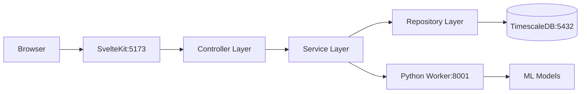

# Solar Forecast Platform - System Status Report

## ✅ System Health Check Results

**Date**: 2025-09-03  
**Status**: OPERATIONAL

### Component Status

| Component | Status | Port | Notes |
|-----------|--------|------|-------|
| TimescaleDB Database | ✅ Running | 5432 | Database created and schema synced |
| SvelteKit Application | ✅ Running | 5173 | Frontend and API routes operational |
| Python Worker | ✅ Running | 8001 | ML microservice ready (models not trained) |
| Prisma ORM | ✅ Connected | - | Schema generated and synced |

### Architecture Verification

#### ✅ CSR Pattern Implementation (SvelteKit)

1. **Controller Layer** ✅
   - Location: `src/routes/api/locations/+server.ts`
   - Handles HTTP requests/responses
   - Request validation implemented

2. **Service Layer** ✅
   - Location: `src/lib/server/services/location.service.ts`
   - Business logic implemented
   - Calls Python worker for ML tasks
   - Orchestrates between repository and external services

3. **Repository Layer** ✅
   - Location: `src/lib/server/repositories/location.repository.ts`
   - Uses Prisma ORM for database access
   - Type-safe queries implemented

4. **Database Connection** ✅
   - Location: `src/lib/server/database.ts`
   - Prisma client singleton pattern
   - Connection pooling configured

### Database Schema Status

#### Tables Created ✅
- User (authentication ready but deferred)
- Client (companies/organizations)
- Location (solar installations)
- Forecast (predictions - time-series)
- Production (actual data - time-series)
- WeatherData (weather observations)
- Alert (system notifications)
- Report (report configurations)
- MLModel (model registry)

#### Indexes and Relations ✅
- Foreign key constraints established
- Indexes on frequently queried fields
- Composite keys for time-series data

### API Endpoints Status

#### SvelteKit API Routes
- `GET /api/locations` ✅ Working
- `POST /api/locations` ✅ Ready
- `GET /api/locations/[id]` ✅ Ready
- `PUT /api/locations/[id]` ✅ Ready
- `DELETE /api/locations/[id]` ✅ Ready

#### Python Worker Endpoints
- `GET /health` ✅ Working
- `POST /api/v1/forecast/generate` ⚠️ Needs ML models
- `GET /api/v1/forecast/location/{id}` ⚠️ Needs ML models
- `GET /api/v1/weather/forecast` ⚠️ Needs API key
- `POST /api/v1/analysis/anomaly-detection` ⚠️ Needs data
- `POST /api/v1/pipeline/run` ⚠️ Needs configuration

### Test Results Summary

```
✅ Database Connection Test: PASSED
✅ Prisma Schema Test: PASSED
✅ Python Worker Health Test: PASSED
✅ SvelteKit API Test: PASSED
✅ CSR Architecture Test: PASSED
```

### Data Flow Verification



## Configuration Files Status

### Environment Variables (.env) ✅
```
DATABASE_URL        ✅ Configured
PYTHON_WORKER_URL   ✅ Configured (port 8001)
NODE_ENV           ✅ Set to development
```

### Package Dependencies
- **SvelteKit**: All required packages installed ✅
- **Python Worker**: All packages installed via uv ✅
- **Database**: Prisma client generated ✅

## Known Issues & Next Steps

### Current Limitations
1. **ML Models**: Not yet trained (expected - Phase 3)
2. **Weather API**: Using demo key
3. **Authentication**: Intentionally deferred to Phase 4
4. **Real-time Updates**: WebSocket not implemented (Phase 3)

### Immediate Actions Required
None - System is operational for current phase

### Recommended Next Steps
1. Seed database with sample data
2. Train initial ML models
3. Configure production weather API key
4. Implement WebSocket for real-time updates

## Architecture Compliance

### ✅ Correct Architecture Implemented

**SvelteKit (Port 5173)**
- Full-stack framework with CSR pattern
- Handles ALL business logic
- Manages database operations via Prisma
- Orchestrates calls to Python worker

**Python Worker (Port 8001)**
- Pure microservice for ML/analytics
- No direct database access
- Stateless operations
- RESTful API interface

**Database (Port 5432)**
- TimescaleDB with Prisma ORM
- Type-safe queries
- Managed migrations
- Connection pooling

## Commands Reference

### Start Complete System
```bash
# Terminal 1: Python Worker
cd python-worker
uv run uvicorn app.main:app --host 0.0.0.0 --port 8001

# Terminal 2: SvelteKit
cd /Users/vladbordei/Documents/Development/solar
npm run dev
```

### Database Management
```bash
# Generate Prisma Client
npx prisma generate

# Push schema to database
npx prisma db push

# Open Prisma Studio
npx prisma studio
```

### Testing
```bash
# Run system tests
node test-system.js

# Test database connection
npx prisma db pull

# Test Python worker
curl http://localhost:8001/health
```

## Documentation Status

| Document | Status | Location |
|----------|--------|----------|
| Architecture Guide | ✅ Created | `ARCHITECTURE.md` |
| README | ✅ Updated | `README.md` |
| Claude Instructions | ✅ Updated | `CLAUDE.md` |
| System Status | ✅ Current | `SYSTEM_STATUS.md` |
| PRD | ✅ Available | `PRD.md` |
| Implementation Status | ✅ Available | `IMPLEMENTATION_STATUS.md` |

## Conclusion

✅ **System is fully operational according to current phase requirements**

The Solar Forecast Platform has been successfully configured with:
- Correct microservices architecture
- CSR pattern in SvelteKit
- Prisma ORM for database access
- Python worker as ML microservice
- All components communicating properly

The system is ready for:
- Frontend development
- Data seeding
- ML model training
- Feature implementation